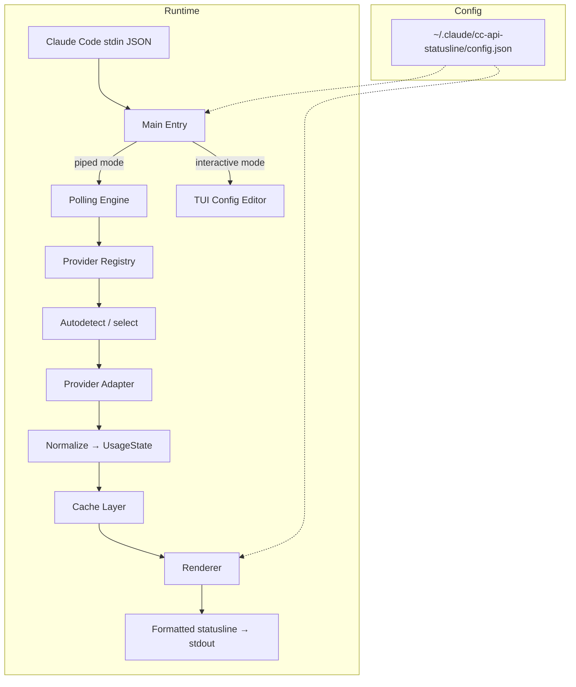

> DEPRECATED REFERENCE: This document reflects pre-unified planning assumptions and may not match current code.
> Use docs/current-implementation.md as source of truth for new work.

# cc-api-statusline — Implementation Handbook

> **Purpose** — A self-contained spec for building a Claude Code statusline tool that polls API usage from third-party proxy backends and renders a configurable TUI/statusline. An implementing agent should be able to work from this document alone.

### Companion spec files

This handbook is the root document. Detailed specs for core areas are in separate files:

| Spec file | Covers |
|---|---|
| [spec-custom-providers.md](file:///Users/liafo/Development/GitWorkspace/cc-api-statusline/docs/spec-custom-providers.md) | User-defined provider registration, JSONPath response mapping, autodetect integration, validation rules |
| [spec-tui-style.md](file:///Users/liafo/Development/GitWorkspace/cc-api-statusline/docs/spec-tui-style.md) | Component hierarchy, layouts (standard/compact/minimal/percent-first), per-component overrides (bar, color, label, countdown), per-part coloring, dynamic color aliases, error display |
| [spec-api-polling.md](file:///Users/liafo/Development/GitWorkspace/cc-api-statusline/docs/spec-api-polling.md) | Poll loop, exponential backoff, disk cache schema, per-terminal isolation, piped vs standalone startup |
| [aux-scaffold-phased-plan.md](file:///Users/liafo/Development/GitWorkspace/cc-api-statusline/docs/aux-scaffold-phased-plan.md) | Scaffold-first setup checklist, phase gates, and execution workflow before/through handbook §10 |
| [ccstatusline-contract-reference.md](file:///Users/liafo/Development/GitWorkspace/cc-api-statusline/docs/ccstatusline-contract-reference.md) | Source-backed host contract details for stdin/stdout/timeout/error behavior in Custom Command mode |
| [aux-ccstatusline-structure-workflow.md](file:///Users/liafo/Development/GitWorkspace/cc-api-statusline/docs/aux-ccstatusline-structure-workflow.md) | ccstatusline codebase structure and developer workflow patterns to reuse in planning |
| [perf-budget.md](file:///Users/liafo/Development/GitWorkspace/cc-api-statusline/docs/perf-budget.md) | Piped-mode latency budget, critical-path targets, and release gate thresholds |

---

## 1  Architecture Overview



### Module breakdown

| Module | Responsibility |
|---|---|
| `main` | Detect piped vs interactive mode, bootstrap config, invoke renderer or TUI |
| `config` | Load/save JSON config, merge defaults, validate schema |
| `providers/registry` | Map of provider IDs → adapter modules + autodetect logic |
| `providers/<name>` | Fetch raw API, map response → `NormalizedUsage` |
| `autodetect` | Resolve `ANTHROPIC_BASE_URL` to a provider via URL-pattern match or lightweight probe |
| `cache` | Read/write disk cache, TTL + ETag/mtime invalidation |
| `polling` | Timer loop: fetch → normalize → cache → re-render; env change detection via `~/.claude/settings.json`; auth error recovery state machine |
| `renderer` | Build statusline string from `NormalizedUsage` + config display settings |
| `tui` | Interactive config editor (future; out of scope for v1 but slot reserved) |

---

## 2  Normalized Usage Schema

All provider adapters must map their response into this shape. The renderer and cache layer only ever work with `NormalizedUsage`.

```ts
interface NormalizedUsage {
  // --- Metadata (always non-null, set by adapter framework) ---
  provider: string                 // e.g. "sub2api", "claude-relay-service"
  billingMode: "subscription" | "balance"
  planName: string                 // human-readable, display-only
  fetchedAt: string                // ISO-8601 UTC, set at fetch time
  resetSemantics: "end-of-day" | "rolling-window" | "end-of-week" | "end-of-month" | "expiry"

  // --- Data fields (all nullable — renderer must tolerate nulls) ---
  daily:   QuotaWindow | null
  weekly:  QuotaWindow | null
  monthly: QuotaWindow | null
  balance: BalanceInfo | null
  resetsAt: string | null          // ISO-8601 UTC, soonest upcoming reset across all windows
  tokenStats: TokenStats | null
  rateLimit: RateLimitWindow | null
}

interface QuotaWindow {
  used: number                     // USD
  limit: number | null             // USD, null = unlimited
  remaining: number | null         // USD, null = unlimited
  resetsAt: string | null          // ISO-8601 UTC
}

interface BalanceInfo {
  remaining: number                // USD
  initial: number | null           // USD, original purchase amount (for auto color)
  unit: string                     // usually "USD"
}

interface TokenStats {
  today: PeriodTokens | null
  total: PeriodTokens | null
  rpm: number | null               // requests/min
  tpm: number | null               // tokens/min
}

interface PeriodTokens {
  requests: number
  inputTokens: number
  outputTokens: number
  cacheCreationTokens: number
  cacheReadTokens: number
  totalTokens: number
  cost: number                     // USD
}

interface RateLimitWindow {
  windowSeconds: number
  requestsUsed: number
  requestsLimit: number | null
  costUsed: number
  costLimit: number | null
  remainingSeconds: number
}
```

> **Metadata fields** (`provider`, `billingMode`, `planName`, `fetchedAt`, `resetSemantics`) are always non-null — they are set by the adapter framework, not mapped from the API response. **Data fields** (quota windows, balance, tokenStats, rateLimit) are all nullable — the renderer must show what's available and gracefully hide what's missing.

---

## 3  Provider Adapters

### 3.1  sub2api

| Item | Value |
|---|---|
| Endpoint | `GET {ANTHROPIC_BASE_URL}/v1/usage` |
| Auth | `Authorization: Bearer {ANTHROPIC_AUTH_TOKEN}` |
| Billing mode detection | Presence of `subscription` object → subscription; otherwise → balance |

#### Mapping rules

**Balance mode**
```
billingMode   = "balance"
balance       = { remaining: resp.remaining, initial: null, unit: resp.unit }
planName      = resp.planName
resetsAt      = null
resetSemantics = "end-of-day" (conventional; no API-level reset)
```

**Subscription mode**
```
billingMode   = "subscription"
daily.used    = resp.subscription.daily_usage_usd
daily.limit   = resp.subscription.daily_limit_usd   (null → unlimited)
daily.remaining = limit != null ? max(0, limit - used) : null
daily.resetsAt = computeNextMidnightUTC()  // sub2api has no explicit daily reset
weekly / monthly analogous (compute from known reset cadence)
resetsAt      = soonest of [daily.resetsAt, weekly.resetsAt, monthly.resetsAt]
resetSemantics = "end-of-day"
```

> **Note**: sub2api does not return per-window reset times. The adapter must **compute** them (all in UTC):
> - `daily.resetsAt` → next midnight UTC
> - `weekly.resetsAt` → next Monday 00:00 UTC (or configured reset day)
> - `monthly.resetsAt` → 1st of next month 00:00 UTC
> - If the API adds `daily_resets_at`, `weekly_resets_at` fields in the future, prefer those.

**Token stats** (both modes, optional)
```
tokenStats.today = resp.usage?.today   →  PeriodTokens (see field mapping below)
tokenStats.total = resp.usage?.total   →  PeriodTokens (see field mapping below)
tokenStats.rpm   = resp.usage?.rpm
tokenStats.tpm   = resp.usage?.tpm
```

**Field mapping** (API snake_case → `PeriodTokens` camelCase):

| API field | PeriodTokens field |
|---|---|
| `requests` | `requests` |
| `input_tokens` | `inputTokens` |
| `output_tokens` | `outputTokens` |
| `cache_creation_tokens` | `cacheCreationTokens` |
| `cache_read_tokens` | `cacheReadTokens` |
| `total_tokens` | `totalTokens` |
| `cost` | `cost` |

#### Edge cases

- `remaining == -1` → treat as unlimited.
- `usage` block may be absent — do not error.
- HTTP `429` → quota exhausted; set all `remaining` to `0` and surface the message.
- HTTP `401/403` → surface as `⚠ Auth error`, enter `AUTH_ERROR_HALTED` state; resume automatically when env change detects new credentials (see spec-api-polling.md Auth Error Recovery).
- HTTP `500` → retry with exponential backoff (5 attempts, then pause).
- Never send `?key=` or `?api_key=` query params (returns 400).

---

### 3.2  claude-relay-service

| Item | Value |
|---|---|
| Endpoint | `POST {ANTHROPIC_BASE_URL}/apiStats/api/user-stats` |
| Auth | Self-auth via body: `{ "apiKey": "{ANTHROPIC_AUTH_TOKEN}" }` |
| Content-Type | `application/json` |
| Billing mode | Always "subscription"-like (cost-limit based) |

#### Request body

```json
{ "apiKey": "cr_your_api_key_here" }
```

#### Mapping rules

```
billingMode     = "subscription"
planName        = resp.data.name || "API Key"

daily.used      = resp.data.limits.currentDailyCost
daily.limit     = resp.data.limits.dailyCostLimit   (0 → unlimited → null)
daily.remaining = limit > 0 ? max(0, limit - used) : null
daily.resetsAt  = null  (resets at midnight server TZ)

weekly.used     = resp.data.limits.weeklyOpusCost
weekly.limit    = resp.data.limits.weeklyOpusCostLimit  (0 → null)
weekly.remaining = ...
weekly.resetsAt = computed from weeklyResetDay + weeklyResetHour

> **Note**: relay's weekly window tracks **Opus-model cost only**, not total cost. Users on relay should customize the label to "Weekly Opus" via `components.weekly.label` config to avoid confusion.

monthly         = null  (no monthly window in this API)

balance         = null  (not a balance-mode API)

resetsAt        = resp.data.limits.windowEndTime
                  ? new Date(resp.data.limits.windowEndTime).toISOString()
                  : null
resetSemantics  = "rolling-window"
                  (describes rate-limit window behavior; daily/weekly cost
                   windows reset at specific times per daily.resetsAt/weekly.resetsAt)

tokenStats.total.requests            = resp.data.usage.total.requests
tokenStats.total.inputTokens         = resp.data.usage.total.inputTokens
tokenStats.total.outputTokens        = resp.data.usage.total.outputTokens
tokenStats.total.cacheCreationTokens = resp.data.usage.total.cacheCreateTokens ?? 0
tokenStats.total.cacheReadTokens     = resp.data.usage.total.cacheReadTokens ?? 0
tokenStats.total.totalTokens         = resp.data.usage.total.tokens ?? (inputTokens + outputTokens)
tokenStats.total.cost                = resp.data.usage.total.cost

rateLimit.windowSeconds       = resp.data.limits.rateLimitWindow * 60
rateLimit.requestsUsed        = resp.data.limits.currentWindowRequests
rateLimit.requestsLimit       = resp.data.limits.rateLimitRequests (0 → null)
rateLimit.costUsed            = resp.data.limits.currentWindowCost
rateLimit.costLimit           = resp.data.limits.rateLimitCost    (0 → null)
rateLimit.remainingSeconds    = resp.data.limits.windowRemainingSeconds
```

#### Edge cases

- `0` in any limit field means "not enforced" → map to `null` (unlimited).
- `windowStartTime: null` + `windowEndTime: null` → window expired, counters are `0`, new window starts on next request.
- `resp.data.limits.totalCostLimit` represents an all-time cap (total lifetime cost limit for the key). This field is **not surfaced in v1** of `NormalizedUsage` — it's informational only. Future versions may add a top-level `totalCostLimit` or `totalRemaining` field.
- Response is always wrapped in `{ success: true, data: {...} }`. Check `success` before mapping.
- HTTP `401` → invalid key. HTTP `403` → disabled/expired. HTTP `404` → key not found. Surface these as `⚠ Auth error`; enter `AUTH_ERROR_HALTED` state; resume automatically when env change detects new credentials (see spec-api-polling.md Auth Error Recovery).

---

## 4  Provider Autodetection

### Design constraints

1. **Near-zero overhead** — detection must not slow down every poll.
2. **O(1) lookup** — URL-pattern match, not linear probing.
3. **Per-terminal** — different terminals can have different `ANTHROPIC_BASE_URL` values.
4. **Cached per base URL** — once detected, memoize; re-detect only on failure.

### Algorithm

```
1. key = ANTHROPIC_BASE_URL (or + hash of auth header/prefix)
2. if cache[key] exists and not expired → return cached provider
3. Check URL-pattern registry:
     registry = [
       { match: (url) => url includes "/apiStats" or starts with known relay prefix,
         provider: "claude-relay-service" },
       { match: (url) => true,  // default fallback
         provider: "sub2api" },
     ]
   First match wins.
4. (Optional) If ambiguous and probe is needed:
     HEAD {baseUrl}/v1/usage  →  if 200/401/403  → sub2api
     HEAD {baseUrl}/apiStats/api/user-stats  → if reachable → relay
5. Cache result: cache[key] = { provider, detectedAt }
6. On fetch failure with unexpected shape → invalidate cache[key], back to step 3
```

### User override

Config supports explicit provider selection that bypasses autodetect:

```json
{ "provider": "sub2api" }
```

### Custom provider definitions

> **Full spec →** [spec-custom-providers.md](file:///Users/liafo/Development/GitWorkspace/cc-api-statusline/docs/spec-custom-providers.md)

Users can register arbitrary providers via config with JSONPath-like response mapping. The spec covers auth modes, validation, and autodetect integration.

---

## 5  Polling & Caching Strategy

> **Full spec →** [spec-api-polling.md](file:///Users/liafo/Development/GitWorkspace/cc-api-statusline/docs/spec-api-polling.md)

Key points (see spec for full details):

- Poll interval: 30 s (configurable), request timeout: 5 s
- Exponential backoff: 5 → 10 → 20 → 40 → 60 s cap; after 5 consecutive failures, pause for 300 s then reset
- Request safety: HTTPS validation (with loopback exception for `127.0.0.1`/`localhost`), 1 MB max response, cross-domain redirect blocking
- Disk cache per-terminal (`~/.claude/cc-api-statusline/cache-<hash>.json`), atomic writes, `0600` perms
- Cache stores `renderedLine` + `configHash` for instant piped-mode output; also stores `tokenHash` and `errorState` for credential-change detection
- Startup: read env vars from `process.env` overlaid with `~/.claude/settings.json` → capture `envSnapshot` → try cached `renderedLine` → load config → render → fetch
- Piped mode: deadline algorithm (`start + timeout - 50ms`); uses `pipedRequestTimeoutMs` (default 800ms) instead of `requestTimeoutSeconds` so a fetch fits within the ccstatusline budget; `tokenHash` mismatch forces re-fetch
- Auth errors (`401/403`): enter `AUTH_ERROR_HALTED` state; show `⚠ Auth error`; automatically resume when env change detection finds new credentials in `~/.claude/settings.json` (see spec-api-polling.md Auth Error Recovery)
- Env change detection (standalone mode): reads `~/.claude/settings.json` at top of each poll cycle; detects `ANTHROPIC_BASE_URL` and `ANTHROPIC_AUTH_TOKEN` changes; emits `⟳` transition indicator and re-fetches immediately (see spec-api-polling.md Environment Change Detection)
- Proxy takeover limitation: cc-switch Proxy Takeover Mode is not compatible — use cc-switch Direct Mode instead (see §8)

---

## 6  Statusline Rendering Model

> **Full spec →** [spec-tui-style.md](file:///Users/liafo/Development/GitWorkspace/cc-api-statusline/docs/spec-tui-style.md)

### Component hierarchy

Each quota component (`daily`, `weekly`, `monthly`) has a **countdown sub-component** that shows the time until *that specific window* resets. Countdown is not a separate top-level section — it belongs to its parent.

```
Daily ━━━━──── 24%·3h12m | Weekly ●●○○○○○○ 22%, resets 5d3h
             ↑ usage        ↑ countdown       ↑ countdown
```

### Layouts (primary label control)

The `layout` key controls how labels, bars, and values are arranged:

| Layout | Label style | Example |
|---|---|---|
| `standard` | Full word | `Daily ━━━━━━━━ 24%·3h12m` |
| `compact` | Single letter | `D ━━━━━━━━ 24%·3h12m` |
| `minimal` | None | `━━━━━━━━ 24%` |
| `percent-first` | Full word, % first | `24% ━━━━━━━━·3h12m` |

Per-component `label` override: set `false` to hide, a string for custom text, or `{ "text": "Today", "icon": "" }` for text + icon variants. Per-component `layout` override is also supported.

### Display modes

Controls how the usage fraction is visualized:
- `bar` — `Daily ━━━━──── 24%`
- `percentage` — `Daily 24%`
- `icon-pct` — `Daily 𝊮 24%` (nerd-font progress circle, 9 glyphs `U+F0130`–`U+F0AA5`)

### Dynamic color

Component `color` can be a fixed value (`"cyan"`, `"#ff5500"`) or a **dynamic alias** that resolves based on usage:
- `"auto"` (default) → green / yellow / red based on `colorThresholds`
- Custom aliases via `colorAliases` config

Per-part coloring via `colors` object: separate colors for `label`, `bar`, `value`, `countdown`. All accept named ANSI, hex (`#ff5500`, `#f50`), or alias names.

### Per-component bar customization

Each component can override `barSize`, `barStyle`, and `color`. Falls back to global `display.*` defaults.

Default bar style: `classic` (thin line — fill: `━`, empty: `─`). Also available: `block`, `shade`, `pipe`, `dot`, `braille`, `square`, `star`, custom `{ fill, empty }`.

Bar empty characters use a dimmed/muted version of the theme’s base color (not the dynamic fill color).

### Render order

Component order in `components` config = render order left-to-right. Omitted components appended in default order.

### Error display

When errors occur:
- **With cache**: append staleness indicator to end of normal output (`[stale Xm]`, `[offline]`)
- **Without cache**: show `⚠ {provider}: {short error message}` in place of normal output
- Auth errors (`401/403`): `⚠ Auth error` — halt polling; resumes automatically when env change detects new credentials
- Missing env vars: `⚠ Set ANTHROPIC_BASE_URL and ANTHROPIC_AUTH_TOKEN`

See the TUI style spec for the full error state table.

### Width & truncation

- `maxWidth`: percentage of terminal width (20–100, default 80).
- Pre-render: skip lowest-priority components if over budget.
- Post-render: ANSI-aware hard truncation with `…` suffix.

---

## 7  JSON Config Schema

Path: `~/.claude/cc-api-statusline/config.json`

```json
{
  "$schema": "...",

  "provider": "auto",

  "pollIntervalSeconds": 30,
  "requestTimeoutSeconds": 5,
  "pipedRequestTimeoutMs": 800,
  "maxConsecutiveFailures": 5,
  "pauseDurationSeconds": 300,

  "display": {
    "layout": "standard",
    "displayMode": "bar",
    "barSize": "medium",
    "barStyle": "classic",
    "separator": " | ",
    "maxWidth": 80,
    "clockFormat": "24h"
  },

  "components": {
    "daily":     { "color": "auto", "countdown": true },
    "weekly":    { "color": "auto", "countdown": true },
    "monthly":   false,
    "balance":   true,
    "tokens":    false,
    "rateLimit": false,
    "plan":      false
  },

  "colorThresholds": { "low": [0, 49], "mid": [50, 79], "high": [80, 100] },
  "themeColors":     { "low": "green", "mid": "yellow", "high": "red" },

  "colorAliases": {},
  "customProviders": {}
}
```

> Components accept `true`/`false` or a full object with keys: `layout`, `displayMode`, `barSize`, `barStyle`, `color`, `colors` (per-part), `label` (string/object/`false`), `countdown` (boolean/object). Component key order = render order. See [spec-tui-style.md](file:///Users/liafo/Development/GitWorkspace/cc-api-statusline/docs/spec-tui-style.md) for all options.

### Env-var overrides

| Env var | Overrides |
|---|---|
| `ANTHROPIC_BASE_URL` | API base URL (per-terminal) |
| `ANTHROPIC_AUTH_TOKEN` | API key / token |
| `CC_STATUSLINE_PROVIDER` | `provider` config key |
| `CC_STATUSLINE_POLL` | `pollIntervalSeconds` |
| `CC_STATUSLINE_TIMEOUT` | Optional manual override for local testing of deadline budget; default is 1000 ms when unset |

---

## 8  ccstatusline Compatibility

cc-api-statusline must work **as a ccstatusline Custom Command widget**. This means:

1. **stdin contract** — ccstatusline calls `execSync(command, { input: JSON.stringify(contextData) })`, piping Claude Code’s context object (containing `model`, `transcript_path`, `session_id`, etc.) as JSON to stdin. **cc-api-statusline ignores this stdin data** — it reads env vars instead. The tool must still accept stdin without blocking or erroring.
2. **stdout contract** — output a single line of text to stdout. ANSI SGR escape codes (color/style: `\x1b[...m`) are supported only when the user enables `preserveColors: true` in ccstatusline’s widget config. **By default, ccstatusline strips SGR codes** (`output.replace(/\x1b\[[0-9;]*m/g, '')`). Other ANSI sequences (cursor movement, etc.) are passed through — avoid emitting them.
3. **Exit behavior** — exit `0` on success. Non-zero on error (ccstatusline shows `[Exit: N]` or `[Error]`).
4. **Timeout** — complete within ccstatusline’s custom command timeout (default 1000 ms, user-configurable to any value). If the command exceeds the timeout, ccstatusline shows `[Timeout]`. Use the deadline algorithm from `spec-api-polling.md` to stay within budget.
5. **Runnable via `bunx`** — package must be published to npm with a `bin` entry.


> [!TIP]
> For latency-sensitive setups, recommend `bun run` with a local install instead of `bunx`. The `bunx` cold-start (package resolution + download) can consume a significant portion of the 1000ms default timeout on first invocation.

> [!IMPORTANT]
> Users **must** enable `Preserve colors: true` in ccstatusline’s widget config for ANSI colors to appear. Without this, all color output is stripped and only plain text is shown.

### ccstatusline integration example

In ccstatusline TUI, add a Custom Command widget:

```
Command:  bunx cc-api-statusline@latest
Timeout:  5000
Preserve colors: true     ← REQUIRED for color output
```

### Standalone mode

When run directly (not via ccstatusline), the tool should still work:
- Read `ANTHROPIC_BASE_URL` and `ANTHROPIC_AUTH_TOKEN` from env (`process.env` overlaid with `~/.claude/settings.json`).
- Detect stdin: if data is piped, read and discard it (ccstatusline compat). If stdin is a TTY, skip.
- Output the statusline to stdout with ANSI colors.
- In standalone mode, ANSI is always emitted (no stripping).
- In standalone mode, the polling loop detects env changes by re-reading `~/.claude/settings.json` at the top of each cycle (see spec-api-polling.md Environment Change Detection).

### cc-switch compatibility

cc-api-statusline is designed to work with cc-switch for runtime provider and credential switching.

| cc-switch mode | Compatible | Notes |
|---|---|---|
| **Direct Mode** | ✅ Yes | cc-switch writes new values to `~/.claude/settings.json → env`. Standalone mode detects the change at the next poll cycle via env change detection and transitions automatically. |
| **Proxy Takeover Mode** | ❌ No | Proxy Takeover routes by path pattern (`/v1/messages`, `/v1/chat/completions`). cc-api-statusline calls different endpoints (`/usage`, `/api/.../stats`) that don't match these routing rules. |

> **Recommended**: Use cc-switch **Direct Mode** when switching providers alongside cc-api-statusline. After switching, the transition indicator (`⟳ Switching provider...`) will appear for one poll cycle, then normal output resumes. Alternatively, run `cc-api-statusline --once` after a provider switch to get an immediate fresh fetch.

---

## 9  Technology & Packaging

| Item | Choice | Rationale |
|---|---|---|
| Language | TypeScript | Matches ccstatusline ecosystem |
| Runtime | Bun + Node.js dual compat | `bunx` for speed, `npx` as fallback |
| Build | `bun build --target=node` | Single-file dist for npm |
| Package manager | bun | Matches ccstatusline |
| npm `bin` | `cc-api-statusline` → `dist/cc-api-statusline.js` | Enables `bunx cc-api-statusline@latest` |
| Config format | JSON | Simple, no TOML dependency |
| Test framework | Vitest (via bun) | Matches ccstatusline |
| Zero runtime deps | Target | Keep install fast |

---

## 10  Implementation Checklist

This is the step-by-step build order. Each step produces a testable artifact.

### Phase 1 — Foundation

- [ ] **1.1** Scaffold project: `package.json`, `tsconfig.json`, `eslint.config.js`, `vitest.config.ts`, `.gitignore`
- [ ] **1.2** Create `src/main.ts` — detect piped vs standalone mode, read env vars
- [ ] **1.3** Create `src/config.ts` — load/save/merge JSON config with defaults (per §7 schema)
- [ ] **1.4** Create `src/types.ts` — all TypeScript interfaces (`NormalizedUsage`, `QuotaWindow`, `ComponentConfig`, `CountdownConfig`, etc.)
- [ ] **1.5** Write unit tests for config loading and defaults

### Phase 2 — Provider Layer

- [ ] **2.1** Create `src/providers/registry.ts` — provider map + `getProvider(id)` + autodetect
- [ ] **2.2** Create `src/providers/sub2api.ts` — fetch + normalize adapter
- [ ] **2.3** Create `src/providers/claude-relay-service.ts` — fetch + normalize adapter
- [ ] **2.4** Create `src/providers/autodetect.ts` — URL-pattern resolver with caching
- [ ] **2.5** Create `src/providers/custom.ts` — user-defined provider with JSONPath mapping (per `spec-custom-providers.md`)
- [ ] **2.6** Write unit tests for all adapters (mock HTTP, verify `NormalizedUsage` output)
- [ ] **2.7** Write unit tests for autodetect logic

### Phase 3 — Cache & Polling

- [ ] **3.1** Create `src/cache.ts` — read/write/validate disk cache with atomic writes, per-terminal isolation (per `spec-api-polling.md`)
- [ ] **3.2** Create `src/polling.ts` — timer loop with backoff, error classification, pause/resume (per `spec-api-polling.md`)
- [ ] **3.3** Write unit tests for cache TTL, atomic writes, fallback behavior

### Phase 4 — Renderer

- [ ] **4.1** Create `src/renderer/index.ts` — compose components into statusline string
- [ ] **4.2** Create `src/renderer/bar.ts` — bar generation (pure function, all built-in + custom styles)
- [ ] **4.3** Create `src/renderer/countdown.ts` — countdown sub-component (per `spec-tui-style.md`): duration/time/auto formats, custom divider, prefix
- [ ] **4.4** Create `src/renderer/component.ts` — per-component rendering: layout-based labels, per-part coloring, displayMode (bar/percentage/icon-pct)
- [ ] **4.5** Create `src/renderer/error.ts` — error state rendering (offline, stale, auth error, missing env)
- [ ] **4.6** Create `src/renderer/colors.ts` — ANSI coloring with threshold logic + theme support
- [ ] **4.7** Create `src/renderer/truncate.ts` — width detection + ANSI-aware truncation
- [ ] **4.8** Write unit tests for all renderer modules (snapshot tests recommended)

### Phase 5 — CLI Integration

- [ ] **5.1** Wire up `main.ts` → poll → render → stdout
- [ ] **5.2** Handle stdin JSON passthrough (ccstatusline compat)
- [ ] **5.3** Add `--help`, `--version`, `--once`, `--config` flags
- [ ] **5.4** Build script: `bun build src/main.ts --target=node --outfile=dist/cc-api-statusline.js`

### Phase 6 — Polish

- [ ] **6.1** End-to-end test: mock server → full pipeline → verify stdout (all display mode combos)
- [ ] **6.2** README with install instructions, screenshots, config examples
- [ ] **6.3** npm publish prep: `prepublishOnly`, `files`, `bin` in `package.json`

### Phase 7 — Future (out of scope for v1)

- [ ] Usage history: sparkline component, runway estimation, velocity indicator (see `spec-api-polling.md`)
- [ ] TUI-based config editor (React/Ink, mirrors ccstatusline pattern)
- [ ] `--install` flag to auto-configure Claude Code `settings.json`

---

## 11  Testing & Debugging (Local Provider Credentials)

Use this section when validating real provider integration during development.

### Where to put sample endpoints/keys

Put local-only secrets in:

`/Users/liafo/Development/GitWorkspace/cc-api-statusline/.agent/debug.env`

This path is gitignored via `.agent`, so credentials stay out of version control.

Suggested file contents:

```bash
SUB2API_BASE_URL="https://your-sub2api-host"
SUB2API_AUTH_TOKEN="sk-..."

RELAY_BASE_URL="https://your-relay-host"
RELAY_AUTH_TOKEN="cr_..."
```

Load in your terminal:

```bash
set -a
source /Users/liafo/Development/GitWorkspace/cc-api-statusline/.agent/debug.env
set +a
```

### Provider-specific smoke tests

Use the sample stdin payload fixture when validating piped mode:

```bash
cat /Users/liafo/Development/GitWorkspace/cc-api-statusline/docs/fixtures/ccstatusline-context.sample.json | \
ANTHROPIC_BASE_URL="$SUB2API_BASE_URL" \
ANTHROPIC_AUTH_TOKEN="$SUB2API_AUTH_TOKEN" \
CC_STATUSLINE_PROVIDER="sub2api" \
bun run src/main.ts --once
```

Shortcut scripts:

```bash
# macOS/Linux
scripts/piped-example.sh sub2api
scripts/piped-example.sh relay
```

```powershell
# Windows PowerShell
.\scripts\piped-example.ps1 -Provider sub2api
.\scripts\piped-example.ps1 -Provider relay
```

sub2api:

```bash
ANTHROPIC_BASE_URL="$SUB2API_BASE_URL" \
ANTHROPIC_AUTH_TOKEN="$SUB2API_AUTH_TOKEN" \
CC_STATUSLINE_PROVIDER="sub2api" \
bun run src/main.ts --once
```

claude-relay-service:

```bash
ANTHROPIC_BASE_URL="$RELAY_BASE_URL" \
ANTHROPIC_AUTH_TOKEN="$RELAY_AUTH_TOKEN" \
CC_STATUSLINE_PROVIDER="claude-relay-service" \
bun run src/main.ts --once
```

### Debug checklist

1. Verify mode detection: piped input should render once and exit; TTY mode should enter poll loop.
2. Verify adapter mapping: inspect rendered components for expected values (`daily`, `weekly`, `balance`, `rateLimit`, `tokens`).
3. Verify cache behavior: first run fetches, subsequent run returns fast from cache when fresh.
4. Verify auth errors: `401/403` shows `⚠ Auth error` state and halts polling; verify that updating credentials in `~/.claude/settings.json` triggers automatic recovery.
5. Verify timeout budget in piped mode: command returns before ccstatusline timeout (default 1000 ms).

### Safety rules for debugging

- Never commit `.agent/debug.env` or copy tokens into docs, tests, or fixtures.
- Never log raw tokens; redact as `***` in any debug output.
- Rotate and revoke shared test keys after debugging sessions.

---

## Appendix A — Response Samples

### sub2api — Subscription mode

```json
{
  "isValid": true,
  "planName": "Pro Plan",
  "remaining": 45.00,
  "unit": "USD",
  "subscription": {
    "daily_usage_usd": 2.50,
    "weekly_usage_usd": 10.00,
    "monthly_usage_usd": 35.00,
    "daily_limit_usd": 10.00,
    "weekly_limit_usd": 50.00,
    "monthly_limit_usd": 100.00,
    "expires_at": "2025-03-01T00:00:00Z"
  }
}
```

### sub2api — Balance mode

```json
{
  "isValid": true,
  "planName": "钱包余额",
  "remaining": 42.50,
  "unit": "USD",
  "balance": 42.50
}
```

### claude-relay-service

```json
{
  "success": true,
  "data": {
    "id": "a1b2c3d4-...",
    "name": "my-key",
    "isActive": true,
    "usage": {
      "total": {
        "requests": 212,
        "tokens": 508322,
        "inputTokens": 198210,
        "outputTokens": 300112,
        "cacheCreateTokens": 5000,
        "cacheReadTokens": 5000,
        "cost": 3.4821,
        "formattedCost": "$3.482100"
      }
    },
    "limits": {
      "dailyCostLimit": 10,
      "currentDailyCost": 1.84,
      "weeklyOpusCostLimit": 25,
      "weeklyOpusCost": 0.91,
      "weeklyResetDay": 1,
      "weeklyResetHour": 0,
      "totalCostLimit": 200,
      "currentTotalCost": 3.4821,
      "rateLimitWindow": 60,
      "rateLimitRequests": 100,
      "rateLimitCost": 1.5,
      "currentWindowRequests": 24,
      "currentWindowCost": 0.73,
      "windowStartTime": 1772055600000,
      "windowEndTime": 1772059200000,
      "windowRemainingSeconds": 1820
    }
  }
}
```

---

## Appendix B — Key Learnings from Reference Repos

| Source | Takeaway |
|---|---|
| **claude-pulse** | Bar rendering, theme system, ANSI-aware truncation, per-section show/hide. Security: domain allowlist + redirect blocking + max response read. Caching: stores rendered line alongside raw data for instant output. History: sparkline via usage samples, linear regression runway estimation. |
| **ccusage** | Hybrid cache (time-expiry + mtime); stale-while-recompute pattern with PID semaphore; burn-rate severity thresholds. **Pitfall**: config values sometimes ignored due to merge bugs — our impl must avoid this. |
| **CCometixLine** | Usage segment options contract, cache compatibility strategy, duration formatting rules, fail-safe defaults over hard errors. |
| **ccstatusline** | Widget registry pattern, dual Bun/Node runtime, React/Ink for TUI, Custom Command widget as integration point, atomic config writes, ANSI color system. |

---

## Appendix C — Security Checklist

- [ ] Never log or persist API tokens.
- [ ] Sanitize all externally-sourced display text (plan names, provider responses).
- [ ] Atomic file writes (`write → rename`) for cache and config.
- [ ] Restrictive file permissions (`0600`) on cache and config. On Windows, rely on user-profile directory ACLs.
- [ ] No `shell=true` / no shell injection vectors.
- [ ] Validate `ANTHROPIC_BASE_URL` is a valid HTTPS URL before sending credentials (loopback exception: `http://127.0.0.1` and `http://localhost` are permitted — credentials never leave the machine).
- [ ] Cap response reads at 1 MB (`resp.read(1_048_576)`) to prevent memory exhaustion.
- [ ] Block HTTP redirects to hosts different from the original `ANTHROPIC_BASE_URL` host.
- [ ] Request timeout enforced on all HTTP requests (default 5s).
